# Hardware

This device demonstrates features of mbed cloud including firmware updates and sensor data uploads. It is built out of about a dozen off-the-shelf parts, for a total cost of roughly 110 USD. The enclosure can be 3D printed, or manufactured in other ways. If the enclosure is 3D printed, sanding and painting is required to give it a nice finished look.

## Parts

Order the following off-the-shelf items:

1. Main board FRDM-K64F
   * Buy: http://www.mouser.com/ProductDetail/NXP/FRDM-K64F/
   * Info: https://developer.mbed.org/platforms/FRDM-K64F/
1. Base Shield V2
   * Info/Buy: https://www.seeedstudio.com/Base%20Shield%20V2-p-1378.html
1. Storage, MicroSD card
   * Buy: https://www.amazon.com/SanDisk-Memory-Frustration-Free-Packaging-SDSDQ-008G-AFFP/dp/B007KFXICK
   * Info: https://www.sandisk.com/home/memory-cards/microsd-cards/sandisk-microsd
1. WiFi ESP8266
   * Info/Buy: https://www.seeedstudio.com/Grove-Uart-Wifi-p-2495.html
1. LED  WS2801 string (7x LEDs)
   * Buy: https://www.amazon.com/WS2801-Module-Without-individually-Addressable/dp/B0192VUDNG/ref=sr_1_2
   * Info: https://cdn-shop.adafruit.com/datasheets/WS2801.pdf
1. LCD  16x2 I2C character display
   * Buy: https://www.amazon.com/gp/product/B01LC7ECAS
   * Info:
     * LCD DM-LCD1602-402: https://drive.google.com/file/d/0B5lkVYnewKTGalhWazNhOGxVbUE/view?usp=sharing
     * display driver SPLC780D: https://drive.google.com/file/d/0BxCL-uXywP6wQXlvMnRIaFN6UVU/view?usp=sharing
     * cross ref product info: https://www.displaymodule.com/products/dm-lcd1602-402
     * cross ref product info: https://www.amazon.com/Qunqi-Serial-Backlight-Arduino-MEGA2560/dp/B01E4YUT3K
   * Note: This component requires the Grove Shield to be set to VCC=5V
1. Low profile angled microUSB cable
   * Buy: https://www.amazon.com/CablesOnline-Micro-B-Position-Extension-AD-U44/dp/B00JSXUJ7Y/
   * Buy: https://www.amazon.com/gp/product/B01LZFKVDP
1. Filter Thermwell 15X24x3/16 Open Cell Foam F1524 Air Conditioner Filter
   * Buy: https://www.amazon.com/gp/product/B000BO68BU
1. Grove Light Sensor (P) v1.1
   * Info/Buy: https://www.seeedstudio.com/Grove-Light-Sensor-%28P%29-v1.1-p-2693.html
1. Grove Temperature&Humidity Sensor Pro
   * Info/Buy: https://www.seeedstudio.com/grove-temperaturehumidity-sensor-pro-p-838.html
1. Battery Pack (LiPo 3.7V/2500mAh)
   * Buy: https://www.adafruit.com/product/328
1. Power Charger (5V/1A LiPo USB)
   * Buy: https://www.adafruit.com/product/2465
1. Power Switch (1P2T SPDT slide switch)
   * Buy: https://www.amazon.com/gp/product/B007QAJMHO

## Install DAPlink onto main board

If you are using a brand new K64 board, it likely will not have DAPLink on it. DAPLink makes flashing firmware onto it much easier.

1. Download https://blackstoneengineering.github.io/DAPLink//firmware/0243_k20dx_frdmk64f_0x5000.bin
1. On the K64 board, hold down reset button and plug it into your computer, it should show up as 'BOOTLOADER'
1. Drag and Drop DAPLink firmware update to the BOOTLOADER usb drive
1. Wait for the firmware to finish being saved
1. Reset the board by power cycling it, the board should re-enumerate as ‘DAPLink’

More details and instructions can be found at https://blackstoneengineering.github.io/DAPLink/

## Modify LEDs

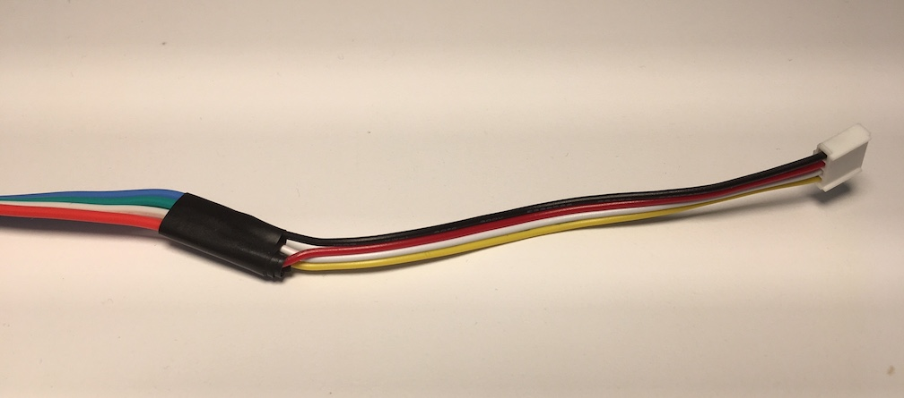

The wires on the LED must be modified to connect to the Base Shield. The LEDs have 4 wires:

1. Ground (GND), blue, must connect to pin "GND" on the base shield.
1. Clock (CO), green, must connect to pin "D3" on the base shield.
1. Data (DO), white, must connect to pin "D2" on the base shield.
1. Power (+5V), red, must connect to pin "VCC" on the base shield.

On the base shield, the slot "D2" has those 4 pins: "GND", "VCC", "D3", and "D2".

## Adjust LCD

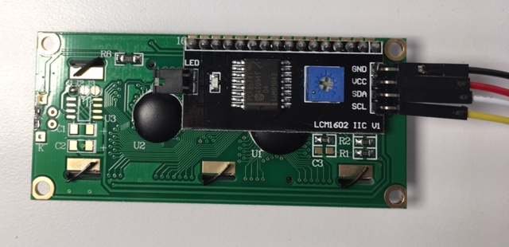

1. Put a jumper on the two pins next to the "LED" label. This is needed to turn on the bright led light.
1. You may have to slightly adjust the screw in the blue box to adjust the brightness of the display. If it is too dim, people won't be able to read the words.

## Basic Connections

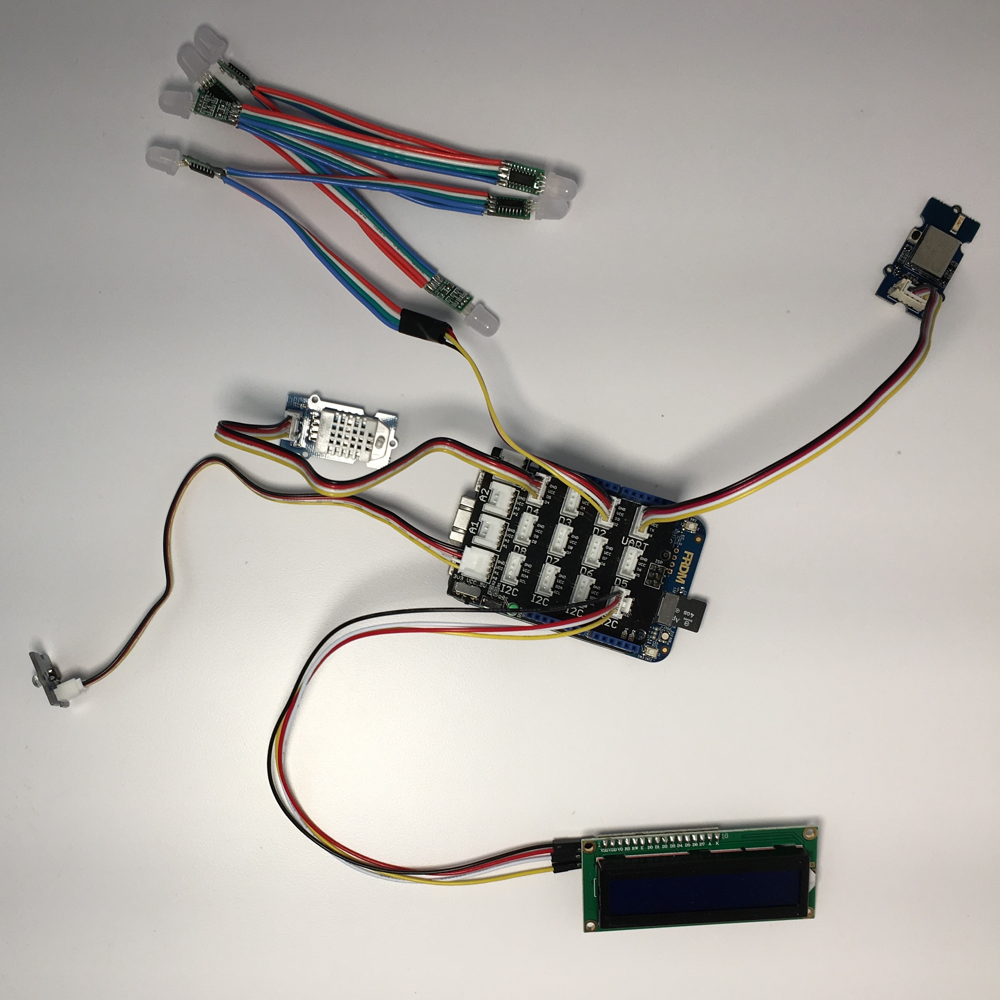

1. Plug the SD Card into the Main Board.
1. Connect the "Base Shield" to the top of the Main Board.
1. Plug the light sensor into port "A0" on the Base Shield.
1. Plug the Temp/Humidity sensor into "D4" on the Base Shield.
1. Plug the Wifi into "UART" on the Base Shield.
1. Plug the LCD into "I2C" on the Base Shield.
1. Plug the LED lights into "D2" on the Base Shield.

## The Case

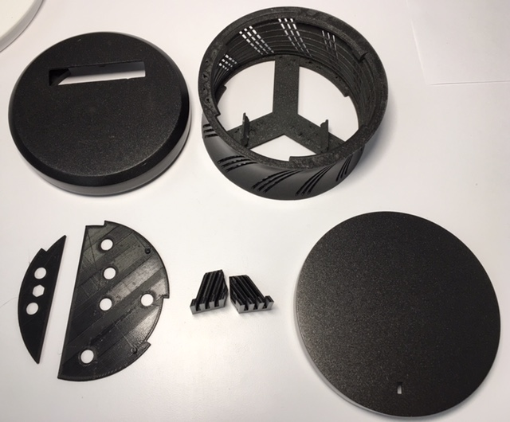

The case can be 3D printed using files at https://github.com/ARMmbed/fota-hardware

There are 7 "STL" files in the directory "CAD/STL/" that can be used by 3D printers or other manufacturing processes to create those parts. (If you wish to edit the design, you'll need to use the software "SolidWorks" to modify the files in the "CAD" directory.)

### If using a 3D printer

Open your printer software, then:

1. Open two files together `Enclosure top.stl` and `Enclosure light pipes.stl`. Right-click and select "merge". These two parts will be printed with different materials. The "top" is opaque, while the "light pipes" are transparent to allow light to shine through.
1. Select print.
1. Wait several hours!

The remaining five STL files can be printed separately. The "body" takes the longest amount of time to print. The externally visible parts (top, middle, and bottom) should be printed using fine-grained settings to ensure as smooth a finish as possible.

### Manufacturing choices

The top part has built-in light channels, so manufacturing choices are split in two categories:

1. Printing the top part without light channels and adding them in-house, either via translucent material pouring (e.g. epoxy or silicone gel), or via press-fitting acrylic cut parts. Both these variants are difficult and are likely to yield low quality results such as uneven surfaces or gaps.
1. Printing the top part with a dual material process. This is the recommended action, even though it comes with a severe limitation in manufacturing processes.

Only fused deposition modeling (FDM) and PolyJet are able to embed translucent material into a part. Of the two, FDM is the most cost effective, and PolyJet is the better looking. The exact difference in unfinished quality will vary with the manufacturer. The recommended course of action is to get one unit with each of the two processes, and pick one to move forward based on visual inspection.

### Finishing choices

We have used manual sanding and painting for the best results. Manufacturing houses all want to avoid this, because of the high and non-scalable cost. Some houses offer automatic sanding and some mention the ability to paint, but without specific pricing. The recommendation is to manufacture the parts with no finish or with only automatic sanding, and see whether the outcome looks satisfactory enough.

## Gluing LEDs into the case

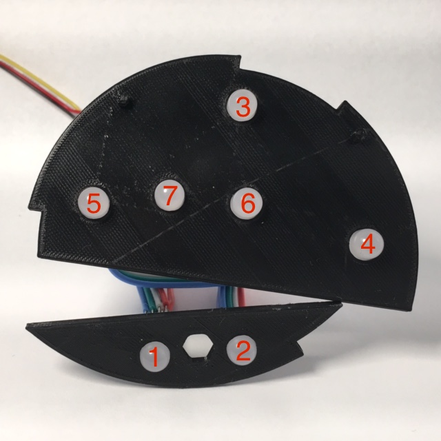

The piece created by the file `Enclosure LED-round plate.stl` holds the LEDs. Super-glue the LEDs into the plate in order from closest (1) to furthest (7) from the board.

## Power switch

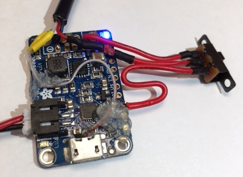

This contains a switch that allows the user to choose either battery or USB power. The USB wire contains has four wires that must be soldered to the correct place: white to pin 2, green to pin 3, black to ground, red to +5 V.

## Bottom with battery and power

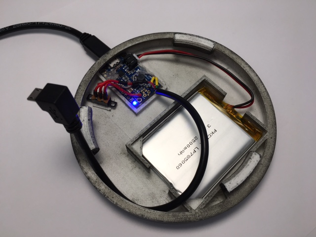

The bottom holds the battery, power switch, and USB charger.

## Top with displays

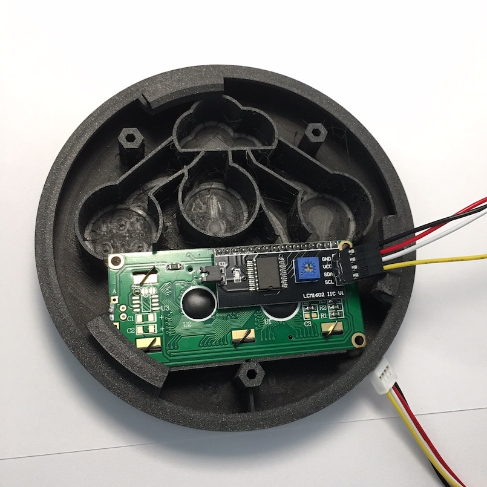
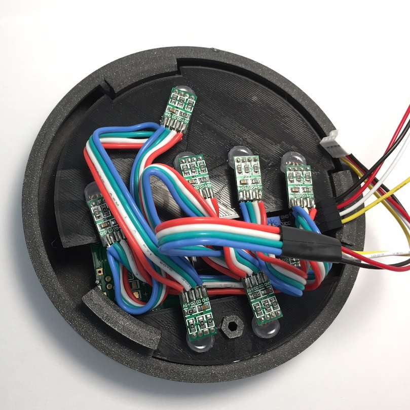

1. Put LCD display into the top first. Use hot glue in the corners to keep it in place.
1. Push the two LED holders into the top.

## Middle with main board and sensors

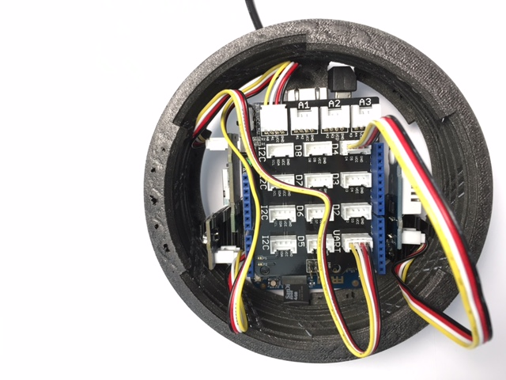

1. Verify the switch on the shield is set to 5V, this is required. Use hot glue to keep it in place.
1. While being careful with the SD card, push the main board down into the middle part of the case (the `Enclosure body`).
1. Push the two sensor mounts (the `Enclosure sensor mounts LHS` and `Enclosure sensor mounts RHS`) down next to main board. They should clip in (or glue).
1. Place the sensors into the sensor mounts.

## Put together the top, middle, and bottom

1. Connect the USB cable from the case bottom to the main board.
1. Connect the LED and LCD cables from the case top to the main board, if not already connected.
1. While keeping all cables inside the case, screw the bottom and the top onto the middle part of the case.
1. Power it on (by turning power switch to us battery) and the device will boot:

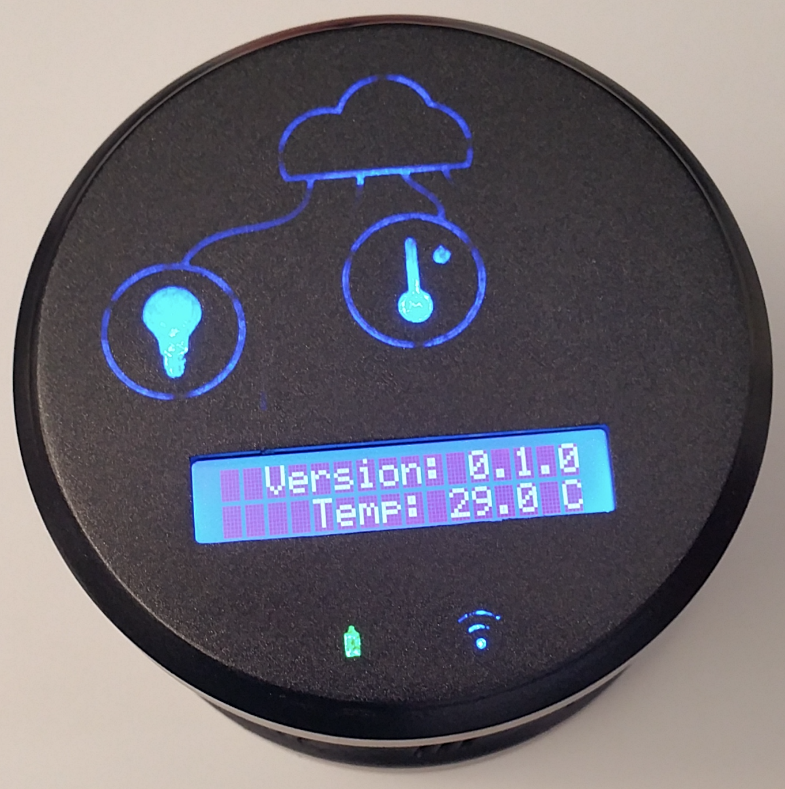

## Test normal start up

1. When power is turned on, a GREEN led should light up the battery icon.
1. The LCD should display "Version" of the device.
1. Wifi LED will flash YELLOW as it tries to connect. 
1. LCD will display the SSID of the wifi it connected to.
1. WiFi LED will be a solid BLUE when the board successfully connects to wifi.
1. The board then attemts to connect to mbed cloud and the cloud LED will flash YELLOW.
1. Reasonable sensor data should display on the LCD (temperature, humidity, and light).
1. The cloud LED will be solid BLUE when the board is connected and registered to the mbed cloud.
1. As sensor data is uploaded, the LEDs for the sensors and cloud will flash GREEN.
